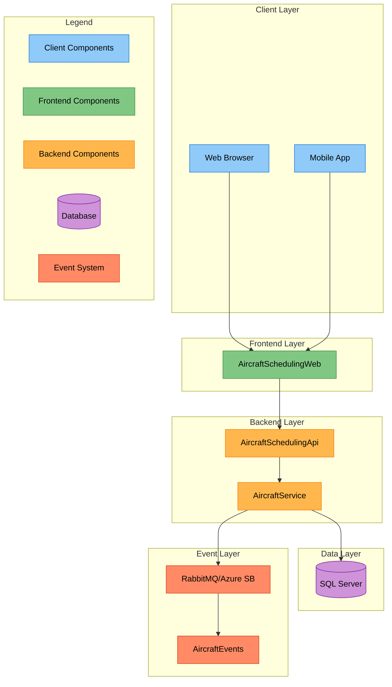
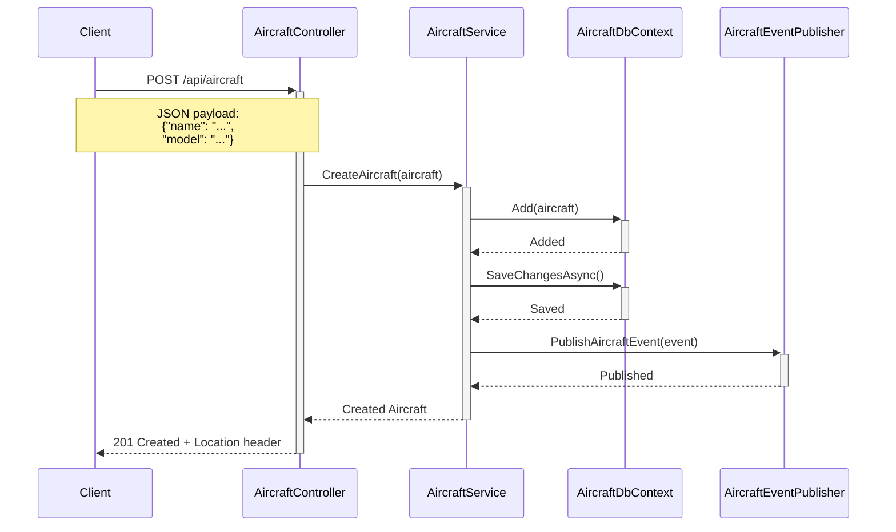
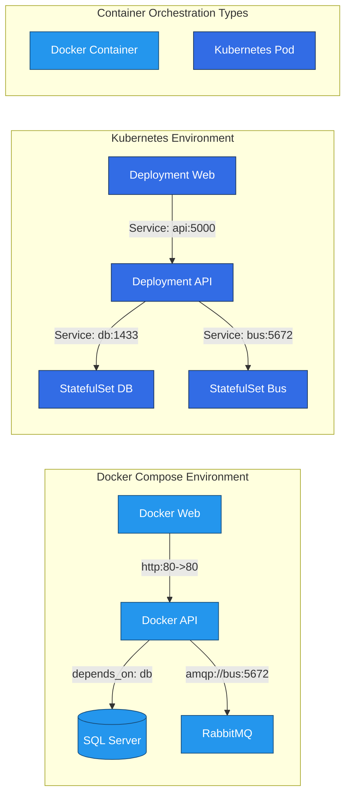

# Aircraft Scheduling and Tracking System Architecture

## Attribution

This document was authored by LeRoy D'Souza

## Table of Contents

- Introduction
- System Architecture Overview
- Backend API Implementation
- Database Design
- Event-Driven Architecture
- Container Orchestration
- CI/CD Pipeline Implementation
- Testing Strategy
- UX/UI Design Principles
- Security Considerations
- Deployment Guidelines
- Conclusion
- Glossary
- Appendix

## Introduction

This comprehensive technical document outlines the architecture and implementation details of the Aircraft Scheduling and Tracking System. The system is designed to provide a robust, scalable, and maintainable solution for managing aircraft operations, with particular emphasis on reliability and performance.

## System Architecture Overview

The system follows a modular architecture with separate components for different responsibilities:

- `AircraftSchedulingApi`: Backend API logic
- `AircraftSchedulingDb`: Database schema and scripts
- `AircraftSchedulingEDA`: Event-driven architecture components
- `AircraftSchedulingWeb`: Frontend web application
- `AircraftSchedulingCI`: CI/CD pipeline scripts
- `docker-compose.yml`: Docker Compose configuration
- `deployment.yaml`: Kubernetes deployment configuration



The system architecture diagram above illustrates the layered design of our aircraft scheduling system. Each color represents a distinct responsibility layer:

- Blue components represent client interfaces
- Green shows frontend services
- Orange indicates backend processing
- Purple denotes database storage
- Red highlights event-driven components

Data flows from clients through the frontend layer to the backend services, which handle both database operations and event publishing. This separation ensures clean boundaries between concerns and enables independent scaling of components.

## Backend API Implementation

The AircraftSchedulingApi directory contains the backend API logic developed using C#/.NET Core:

```csharp
[ApiController]
[Route("api/[controller]")]
public class AircraftController : ControllerBase
{
    private readonly IAircraftService _service;

    public AircraftController(IAircraftService service)
    {
        _service = service;
    }

    [HttpGet]
    public async Task<ActionResult<IEnumerable<Aircraft>>> GetAircraft()
    {
        return await _service.GetAircraft();
    }

    [HttpPost]
    public async Task<ActionResult<Aircraft>> CreateAircraft(Aircraft aircraft)
    {
        return await _service.CreateAircraft(aircraft);
    }
}

public class Aircraft
{
    public int Id { get; set; }
    public string Name { get; set; }
    public string Model { get; set; }
}

public interface IAircraftService
{
    Task<IEnumerable<Aircraft>> GetAircraft();
    Task<Aircraft> CreateAircraft(Aircraft aircraft);
}

public class AircraftService : IAircraftService
{
    private readonly AircraftDbContext _context;

    public AircraftService(AircraftDbContext context)
    {
        _context = context;
    }

    public async Task<IEnumerable<Aircraft>> GetAircraft()
    {
        return await _context.Aircrafts.ToListAsync();
    }

    public async Task<Aircraft> CreateAircraft(Aircraft aircraft)
    {
        _context.Aircrafts.Add(aircraft);
        await _context.SaveChangesAsync();
        return aircraft;
    }
}

public class AircraftDbContext : DbContext
{
    public AircraftDbContext(DbContextOptions<AircraftDbContext> options) : base(options)
    {
    }

    public DbSet<Aircraft> Aircrafts { get; set; }
}
```



The sequence diagram above illustrates the flow of creating an aircraft record. The solid arrows represent method calls, while dashed arrows show responses. Notice how the operation is fully asynchronous, ensuring non-blocking I/O operations. After successfully saving the aircraft data, an event is published to notify other parts of the system about the change.

## Database Design

The AircraftSchedulingDb directory contains the database schema and scripts for SQL Server:

```sql
CREATE TABLE Aircrafts (
    Id INT PRIMARY KEY IDENTITY(1,1),
    Name NVARCHAR(100),
    Model NVARCHAR(100)
);
```

## Event-Driven Architecture

The AircraftSchedulingEDA directory contains components for event-driven architecture using Azure Service Bus or RabbitMQ:

```csharp
using Azure.Messaging.ServiceBus;

public class AircraftEventPublisher
{
    private readonly ServiceBusClient _serviceBusClient;
    private readonly ServiceBusSender _sender;

    public AircraftEventPublisher(string connectionString, string queueName)
    {
        _serviceBusClient = new ServiceBusClient(connectionString);
        _sender = _serviceBusClient.CreateSender(queueName);
    }

    public async Task PublishAircraftEvent(AircraftEvent @event)
    {
        var message = new ServiceBusMessage(@event.ToString());
        await _sender.SendMessageAsync(message);
    }
}

public class AircraftEvent
{
    public string EventType { get; set; }
    public Aircraft Aircraft { get; set; }
}
```

## Container Orchestration

The system supports both Docker Compose and Kubernetes deployments:



The diagram above illustrates the container orchestration strategies for both Docker Compose and Kubernetes environments. In Docker Compose, containers communicate directly using port mappings and dependencies. In Kubernetes, services are exposed through cluster IPs, and stateful sets are used for databases and message queues to maintain persistent storage and ordered deployment.

## CI/CD Pipeline Implementation

```yaml
name: Build and Deploy

on:
  push:
    branches:
      - main

jobs:
  build-and-deploy:
    runs-on: ubuntu-latest
    steps:
      - name: Checkout code
        uses: actions/checkout@v2

      - name: Login to DockerHub
        uses: docker/login-action@v1
        with:
          username: ${{ secrets.DOCKER_USERNAME }}
          password: ${{ secrets.DOCKER_PASSWORD }}

      - name: Build and push Docker image
        run: |
          docker build -t aircraft-scheduling-api .
          docker tag aircraft-scheduling-api:latest ${{ secrets.DOCKER_USERNAME }}/aircraft-scheduling-api:latest
          docker push ${{ secrets.DOCKER_USERNAME }}/aircraft-scheduling-api:latest

      - name: Deploy to Kubernetes
        uses: kubernetes/deploy-action@v1
        with:
          kubeconfig: ${{ secrets.KUBECONFIG }}
          deployment: aircraft-scheduling-api
```

## Testing Strategy

The system implements a comprehensive testing strategy:

1. Unit Testing
  - Backend components using NUnit/xUnit
  - Frontend components using Jest


2. Integration Testing
  - API endpoints using Postman
  - Database operations
  - Event-driven interactions


3. User Acceptance Testing (UAT)
  - Functional requirements validation
  - User interface testing
  - Business workflow verification


## UX/UI Design Principles

The system follows professional UX/UI design principles:

1. User-Centric Design
  - Clear navigation patterns
  - Intuitive controls
  - Consistent feedback mechanisms


2. Performance Optimization
  - Lazy loading of resources
  - Caching strategies
  - Optimized data fetching


3. Security Considerations
  - Input validation
  - Authentication/Authorization
  - Data encryption


## Deployment Guidelines

1. Development Environment
  - Docker Compose for local development
  - Hot reload for frontend changes
  - Debugging tools integration


2. Production Environment
  - Kubernetes for orchestration
  - Load balancing configuration
  - Monitoring and logging setup


## Conclusion

The Aircraft Scheduling and Tracking System demonstrates a modern, scalable architecture that combines robust backend services with a user-friendly frontend interface. The system's modular design enables easy maintenance and future enhancements, while the event-driven architecture ensures reliable operation under various load conditions. The comprehensive testing strategy and deployment guidelines ensure high quality and reliability in production environments.

## Glossary

- API: Application Programming Interface
- CI/CD: Continuous Integration/Continuous Deployment
- Container: Lightweight and standalone executable package
- Event-Driven Architecture: Design pattern where components communicate through events
- Kubernetes: Container orchestration system
- Microservices: Small, independent services that communicate with each other
- Orchestration: Automated deployment and management of containers
- Stateful
